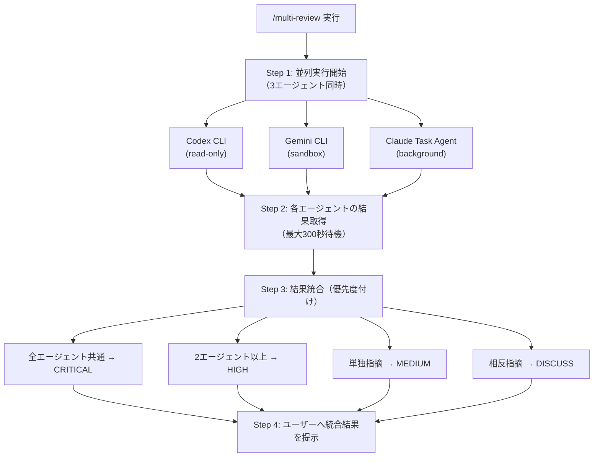

# Multi-Review Skill

## Overview

3つのAIエージェント（Codex CLI、Gemini CLI、Claude Code Task agent）を**並列実行**し、多角的な視点でコードレビューを行うスキル。

- 各エージェントは**読み取り専用**モードで実行
- ファイル修正は一切行わず、レビューコメントのみ提供
- 結果を優先度付けして統合し、ユーザーに提示

## Scope

### ユースケース

| ユースケース | 説明 |
|-------------|------|
| PRレビュー | プルリクエストの変更内容を複数視点で精査 |
| アーキテクチャ決定 | 設計判断に対する多角的フィードバック |
| デバッグ支援 | バグの原因特定に向けた複数アプローチ |
| セカンドオピニオン | 重要な実装判断への複数意見取得 |

### 対象外

- 自動修正・リファクタリング実行
- コード生成
- ファイルの作成・削除・変更

## Usage

```
/multi-review [対象ファイル/ディレクトリ] [レビュー依頼内容]
```

### パラメータ

| パラメータ | 必須 | 説明 |
|-----------|------|------|
| 対象ファイル/ディレクトリ | Yes | レビュー対象のパス |
| レビュー依頼内容 | Yes | レビューの観点・質問 |

### 例

```
/multi-review src/auth/ セキュリティの観点でレビューしてください
/multi-review ./api/handler.go エラーハンドリングの改善点を指摘してください
/multi-review . このPRの変更全体をレビューしてください
```

## Workflow



## Agent Prompts

### Codex CLI

```bash
codex exec --sandbox read-only -C {project_directory} "{review_prompt}

重要な制約:
- このレビューは読み取り専用です
- ファイルの修正、作成、削除は絶対に行わないでください
- 問題点の指摘と改善提案のみを行ってください
- 具体的なコード例を示す場合は、コメント内で提示してください"
```

### Gemini CLI

```bash
gemini -s -y "{review_prompt}

重要な制約:
- このレビューは読み取り専用です
- ファイルの修正、作成、削除は絶対に行わないでください
- 問題点の指摘と改善提案のみを行ってください
- 具体的なコード例を示す場合は、コメント内で提示してください"
```

### Claude Code Task Agent

```
Task tool invocation:
  subagent_type: general-purpose
  run_in_background: true
  prompt: |
    {review_prompt}

    重要な制約:
    - このレビューは読み取り専用です
    - ファイルの修正、作成、削除は絶対に行わないでください
    - Read、Grep、Glob ツールのみ使用してください
    - Edit、Write、Bash（書き込み系コマンド）は使用禁止です
    - 問題点の指摘と改善提案のみを行ってください
```

## Error Handling

| 状況 | 挙動 |
|------|------|
| 1エージェント失敗 | 他2エージェントの結果で継続、失敗したエージェント名を通知 |
| 2エージェント失敗 | 成功エージェントの結果のみ提示、警告メッセージ付与 |
| 全エージェント失敗 | エラー詳細を表示、手動レビューを推奨 |
| タイムアウト（300秒） | 取得済みの部分結果で継続、未完了エージェントを通知 |

### エラーメッセージ例

```
[WARNING] Codex CLI がタイムアウトしました。Gemini CLI と Claude Task Agent の結果を表示します。

[ERROR] 全エージェントが失敗しました。
- Codex CLI: Connection timeout
- Gemini CLI: API rate limit exceeded
- Claude Task: Context length exceeded

手動でのレビューを推奨します。
```

## Result Integration Logic

### 優先度判定

| 条件 | 優先度 | 表示 |
|------|--------|------|
| 3エージェント全てが指摘 | CRITICAL | 即座に対応が必要 |
| 2エージェントが指摘 | HIGH | 強く推奨される改善 |
| 1エージェントのみ指摘 | MEDIUM | 検討を推奨 |
| エージェント間で相反 | DISCUSS | 両論を提示、ユーザー判断 |

### 統合出力フォーマット

```markdown
## Multi-Review Results

### CRITICAL (全エージェント一致)
- [指摘内容]
  - Codex: [詳細]
  - Gemini: [詳細]
  - Claude: [詳細]

### HIGH (2エージェント一致)
- [指摘内容]
  - 指摘元: Codex, Gemini

### MEDIUM (単独指摘)
- [指摘内容]
  - 指摘元: Claude
  - 検討ポイント: [なぜ他エージェントは指摘しなかったか]

### DISCUSS (相反意見)
- [論点]
  - Codex の見解: [内容と根拠]
  - Gemini の見解: [内容と根拠]
  - 判断のポイント: [ユーザーが考慮すべき点]
```

## Examples

### Example 1: セキュリティレビュー

**Input:**
```
/multi-review src/auth/login.ts 認証ロジックのセキュリティをレビューしてください
```

**Output:**
```markdown
## Multi-Review Results

### CRITICAL (全エージェント一致)
- パスワードのハッシュ化にMD5が使用されています
  - Codex: MD5は暗号学的に破られており、bcryptまたはArgon2への移行を推奨
  - Gemini: MD5は衝突攻撃に脆弱。OWASP推奨のbcrypt使用を提案
  - Claude: MD5使用はセキュリティリスク。bcrypt(cost=12以上)への変更を推奨

### HIGH (2エージェント一致)
- レートリミットが未実装
  - 指摘元: Codex, Claude
  - 推奨: ログイン試行回数の制限を追加

### MEDIUM (単独指摘)
- セッションタイムアウトが24時間と長い
  - 指摘元: Gemini
  - 検討ポイント: ユースケースによっては許容範囲の可能性あり
```

### Example 2: アーキテクチャレビュー

**Input:**
```
/multi-review ./services/ マイクロサービス間の依存関係をレビューしてください
```

**Output:**
```markdown
## Multi-Review Results

### HIGH (2エージェント一致)
- order-service と payment-service 間に循環依存
  - 指摘元: Codex, Claude
  - 推奨: イベント駆動アーキテクチャで疎結合化

### DISCUSS (相反意見)
- 共有データベースパターンの使用について
  - Codex: アンチパターン。サービスごとにDBを分離すべき
  - Gemini: 現段階では許容。スケール時に分離を検討
  - 判断のポイント: 現在のトラフィック量とスケール計画を考慮
```

## Guidelines

### 安全性

1. **読み取り専用の徹底**
   - 全エージェントは読み取り専用モードで実行
   - ファイル変更の可能性を完全に排除

2. **サンドボックス実行**
   - Codex CLI: `--sandbox read-only` 必須
   - Gemini CLI: `-s` (sandbox) 必須
   - Claude Task: 書き込み系ツール使用禁止を明示

3. **タイムアウト制御**
   - 最大300秒で強制終了
   - 無限ループ・ハング防止

### 役割分担

| 役割 | 担当 |
|------|------|
| コード解析・パターン検出 | 全エージェント |
| セキュリティ観点 | 全エージェント |
| パフォーマンス観点 | 全エージェント |
| 結果統合・優先度付け | Skill実行エージェント |
| 最終判断 | ユーザー |

### 禁止事項

- ファイルの修正・作成・削除
- 外部APIへの書き込みリクエスト
- システム設定の変更
- 認証情報へのアクセス

## Troubleshooting

### よくある問題

| 問題 | 原因 | 対処 |
|------|------|------|
| Codex CLI が起動しない | 未インストール | `npm install -g @openai/codex` |
| Gemini CLI がエラー | API キー未設定 | `gemini auth login` を実行 |
| Claude Task が遅い | 大量ファイル | 対象ディレクトリを絞る |
| 結果が少ない | プロンプト不足 | レビュー観点を具体化 |

### デバッグモード

詳細なログが必要な場合:
```
/multi-review --verbose src/ レビューしてください
```
